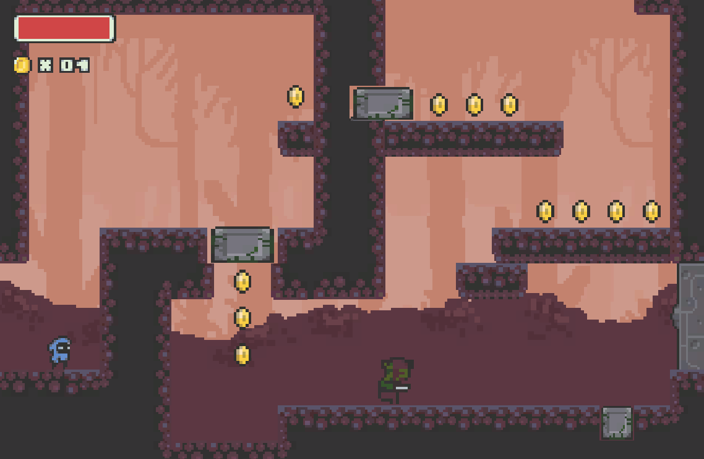

# Fund_Proj
Repositorio del proyecto final de Fundamentos del Desarrollo de Videojuegos

### Cambios desde la presentación:
* Arreglo de erratas en la pantalla de título (había una errata en el título).

* Arreglo del funcionamiento del gancho (arreglado fallo donde el gancho en ocasiones se negaba a engancharse a ciertos objetos)

* Agregado de cinemachine respetando el scroll.

### Concepto
El proyecto consiste en juego de plataformas y combate 2D. Dentro del juego, el jugador cuenta con un gancho para moverse por el mapa para interactuar con el entorno.

### Características del proyecto

* Videojuego 2D: Videojuego en dos dimensiones con animaciones programadas y tiles colocados mediante tilemaps.

* Uso extenso de propiedades físicas: Mezcla de objetos estáticos y dinámicos a lo largo del proyecto.

* Gancho: Uso de un gancho que puede utilizarse para colgarte y arrastrar para maniobrar por el entorno y resolver puzzles. El gancho fija el punto de agarre mediante raycast.

* Eventos: Uso de eventos para controlar aspectos de la jugabilidad, como por ejemplo el control de la vida, la acción de palancas o las monedas.

* Control de cámara mediante scroll: scroll al sobrepasar los límites de la cámara al estilo metroid.

* Pantalla principal y menú de pausa.
